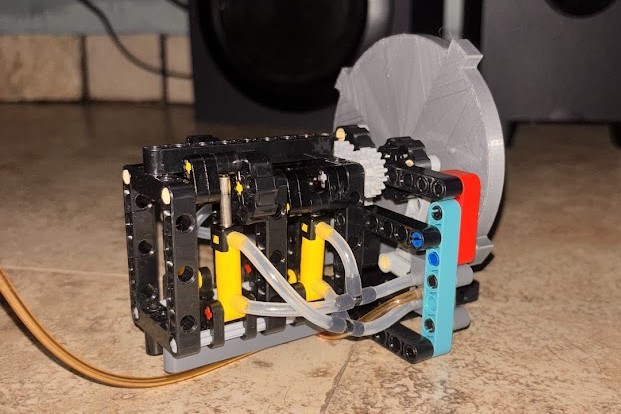
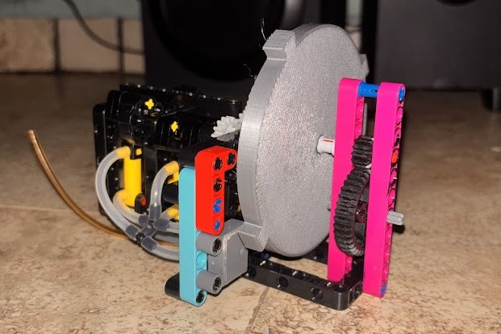

# Pneumatic engine 2.1

<table>
  <tr>
    <td></td>
    <td></td>
  </tr>
  <tr>
    <td align="center">Front view</td>
    <td align="center">Back view</td>
  </tr>
</table>

This was basically the same as the 2.0, but optimized to ocupy less space, instead of having the timing components on the front of the engine and the output or flywheel on the back, we placed the timing components on the back with the output, that way, the frame doesnt have to extend sideways both on the back and on the front, making the front of the engine just 5 studs wide.The gears that connect each crankshaft are the same amount of teeth, so theres a 1:1 connection from both cranks to the output, after we tested the diferent ratios in [**this test log**](../../../../logs/tests/engine_output_ratios.md).